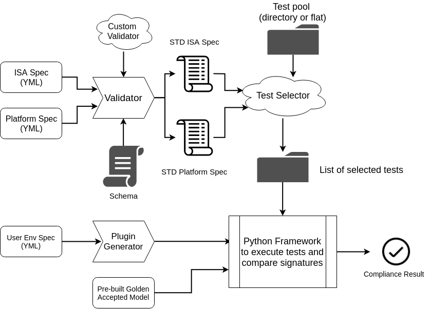

.. RISCOF documentation master file, created by
   sphinx-quickstart on Thu May 23 12:47:39 2019.
   You can adapt this file completely to your liking, but it should at least
   contain the root `toctree` directive.

Welcome to RISCOF
=================

.. toctree::
   :maxdepth: 2
   :caption: Contents:

**RISCOF** (RISC-V Compliance Framework) is a YAML based framework which can be used to prove compliance of a RISC-V implementation against the RISC-V privileged and unprivileged ISA spec. 

**Caution**: This is still a work in progress and non-backward compatible changes are expected to happen. 

For more information on the official RISC-V compliance and test suite please visit: `Github <https://github.com/riscv/riscv-compliance>`_

Overall RISCOF Flow
-------------------

The following diagram captures the over-flow of RISCOF.

The user is required to provide 3 YAML files as input to the flow:

1. **ISA Spec**: This YAML file is meant to capture the ISA related features implemented by the user. Details of this input file can be found here : isa_schema_. 
2. **Platform Spec**: This YAML file is meant to capture the platform specific features implemented by the user. Details of this input file can be found here : platform_schema_.
3. **Env Spec**: This YAML file is meant to capture the options and spec of how the user provided implementation is to be executed/run and how the signature should be extracted for each test. This spec is used to create a python-based plugin for executing the implementation. By using the plugin feature, one can use the same plugin for implementations varying in ISA and Platform spec. Details: *[WIP]*

Working:
^^^^^^^
The ISA and Platform spec are first checked by the validator for any inconsistencies. Checks like 'F' to exist for 'D' are performed by the validator. The validator will exit with an error indicating any inconsistencies in both the specs. Once the validator checks pass, two separate standard yaml files are generated, one for each input type. These standard yaml files contains all fields elaborated and additional info for each node. While the user need not specify all the fields in the input yaml files, the validator will assign defaults to those fields and generate a standard exhaustive yaml for both ISA and Platform spec.

From the standard YAMLs generated by the validator and the test-pool, the 'Test Selector' identifies the list of all tests that need to run on the given implementation for compliance.

The Env spec from the user is passed into a plugin-generator to generate a python-plugin which contains information on how the to execute tests on the user implementation and how to extract the signature. Once this plugin is generated for an implementation, it can directly be used into the framework without having to provide the Env-Spec. The same procedure is followed to produce a plugin for the golden-model as well. Please note, the Env Spec does not under-go any validation and it is thus the onus of the user to ensure that the plug-in has been correctly generated for execution.

The list of tests, implmentation-plugin and golden-plugin are all fed into the python-framework, which iterates over executing tests on the both the plugins and comparing signatures. The result of the tests if provided at the end as a report indicating which tests passed and which failed.

YAML Specifications
-------------------

This section provides details of the ISA and Platform spec YAML files that need to be provided by the user.

WARL field Restriction Proposal
^^^^^^^^^^^^^^^^^^^^^^^^^^^^^^^

Since the RISC-V privilege spec indicates several CSRs and sub-fields of CSRs to be WARL (Write-Any-Read-Legal), it is now necessary to provide a scheme of WARL functions which can be used to precisely define the functionality of anysuch WARL field/register.

The following proposal for WARL functions was made by **Allen Baum (: esperanto)** and has been adopted in this framework.

1. **Distinct** (*distinct-warl-func*) 

  * A list of distinct values which are considered as legal and any value not in the list is considered as illegal.
  * When an illegal value is written (*WriteVal*) to this field, the next valid value of the field can be deduced based on the following modes:
      * UnChgd: The value remains unchanged
      * NextUp: ceiling(*WriteVal*) i.e. the next larger or the largest element of the list
      * NextDown: floor(*WriteVal*) i.e. the next smalles or the smallest element of the list
      * NearUp: celing(*WriteVal*) i.e. the closest element in the list, with the larger element being chosen in case of a tie.
      * NearDown: floor(*WriteVal*) i.e. the closes element in the list, with the smaller element being chosen in case of a tie
      * Largest: maximum of all legal values
      * Smallest: minimum of all legal values

    
2. **Range** (*range-warl-func*)

  * Legal values are defined as all values that lie within the set: *[Lower, Upper]* inclusive
  * When an illegal value is written (*WriteVal*) to this field, the next valid value of the field can be deduced based on the following modes:
      * Saturate: 

        .. code-block:: python 

          if ( WriteVal < Lower )
             return Lower; 
          else if( WriteVal > Upper )
             return Upper;
          else 
             return no-change

      * UnChgd

        .. code-block:: python
    
          if ( WriteVal < Lower || WriteVal > Upper)
             return no-change

      * Addr: 

        .. code-block:: python
    
          if ( WriteVal < Lower || WriteVal > Upper)
             return Flip-MSB of field

3. **Bitmask** (*bitmask-warl-func*)

  * This function is represented with 2 fields: the *Base* and the *Value*
  * For the read only positions, the corresponding bits are cleared (=0) in the *Base* and the rest of the bits are set (=1).
  * In the *Value* field the values for the read only bits are given ( = 0 or 1) and the rest of the bits are cleared (=0).

These fields can be implemented as one of the following three types.

.. _isa_schema:

ISA Schema
^^^^^^^^^^

.. autoyaml:: ../rips/schema-isa.yaml

.. _platform_schema:

Platform Schema
^^^^^^^^^^^^^^^

.. autoyaml:: ../rips/schema-platform.yaml

SchemaValidator
^^^^^^^^^^^^^^^

.. automodule:: rips.schemaValidator
   :members: 
   :special-members:
   :private-members:

Indices and tables
------------------

* :ref:`genindex`
* :ref:`modindex`
* :ref:`search`

