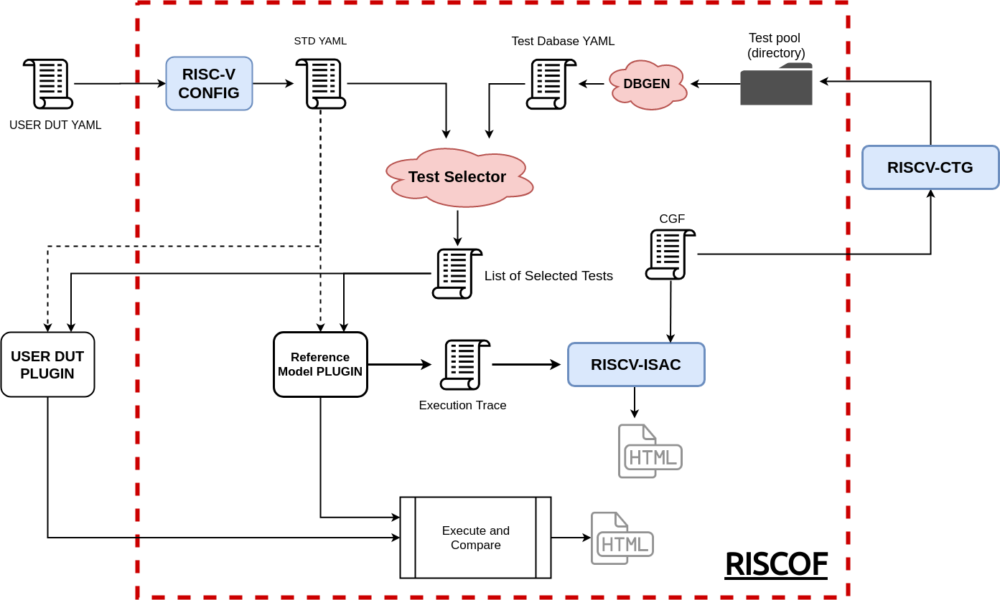

########
Overview
########

The following diagram captures the overall flow of RISCOF and its components. The red bounding box
denotes the RISCOF framework. Components outside the box either denote user inputs or external tools
that RISCOF can work with. The inputs and components of RISCOF are discussed in detail in the
following sections.

Inputs to the framework
=======================

As can be seen in the image above, the framework requires 2 specific inputs from the user:

1. A RISCV-CONFIG based YAML specification of the ISA choices made by the user. Details on writing
   the specific YAML spec can be found here : `Spec Documentation <https://riscv-config.readthedocs.io/en/latest/yaml-specs.html>`_
2. A Python plugin which can be used by the framework to compile the test, simulate the test and
   extract the signature of each test. Steps to define the python plugin is available in the
   :ref:`plugins` section.

External Dependencies
=====================

The RISCOF framework currently depends on two major external tools:

1. `RISCV-CONFIG <https://riscv-config.readthedocs.io/en/latest>`_: This tool is required to validate
   the legality of the input ISA YAML provided by the user. RISCV-CONFIG will capture any
   irregularities found in the YAML which indicate conflicting choices made by the user as opposed
   to what is mentioned in the RISC-V specification. Once all the checks are passed, RISCV-CONFIG
   will produce a standardized/normalized version of the input YAML. This standardized version is
   further used in the process of selecting tests and configuring the reference model accordingly.

2. `RISCV-ISAC <https://riscv-isac.readthedocs.io/en/latest>`_: This tool is used to provide a
   coverage analysis and an assessment of the quality of the architectural suite available in RISCOF
   today. This tool is essentially helpful for test authors and test contributors to validate if
   their tests meet the requirements and standards to be included in the architectural test suite.

Internal Components
===================

Apart from the external dependencies mentioned in the previous section, RISCOF also include a few
internal utilities

- **DBGEN** : RISCOF internally maintains a database of all the assembly tests available in the 
  architectural test suite. This database is maintained as a YAML file and serves the purpose of 
  selecting relevant tests for a given DUT model. DBGEN automates the generation of this YAML file
  based on the tests available in RISCOF. 

  This utility is targeted to be used by test contributors to update the database with their new
  tests. More information on its features and usage please see :ref:`database`

- **Test Selector**: RISCOF, as it evolves, shall encompass a large number of architectural tests.
  However, not all of the tests may apply to a given configuration of a RISC-V Target. Thus, the
  *Test Selector* utility uses the standardized RISCV-CONFIG specification from the user and the
  database of tests to filter and select only those tests which are applicable to the RISC-V target
  under consideration. This list is presented as a YAML file and more information on this format is
  available in :ref:`testlist`. 

  This utility is currently internal to RISCOF and is not available as a separate cli (command line
  interface). Neither users or contributors should need to deal with this utility as a separate
  module.

Execution flow for Users
========================

As mentioned in the :ref:`audience` the primary users of RISCOF are verification and design
engineers who would like to validate their implementation's adherence to the RISC-V ISA
specification. This subsection will provide an overall working of the RISCOF in the context of
validating a RISC-V target against a golden reference model.

.. note:: The following explanation is at an abstract level and assumes that the user has RISCOF and 
   the respective tooling available. For a walk-through guide to install RISCOF and setting up the 
   required tooling please refer to :ref:`quickstart`

The flow starts with the user providing a YAML specification which captures the choices made in the
implementation and also providing a python plugin (a python code written with certain defined
constraints) which can enable compilation and simulation of a test on the implementation. 

The input YAML is first validated using the RISCV-CONFIG tool to confirm the implementation choices
adhere to the those defined by the RISC-V ISA spec. The output of this is the
standardized/normalized YAML spec containing all the information of the implementation. 

The normalized YAML is then fed to the *Test Selector* utility to filter and select tests from the
test-pool which are applicable to the implementation of the user. These selected tests are written
out in a YAML file and represent the *test-list*. 

The normalized YAML is also fed into the reference model's python plugin to configure the model to
mimic the implementation as close as possible.

The *test-list* is next forwarded to both, the user and reference defined python plugins, to
initiate compilation and execution of the tests on the respective platforms. 

One should note the each test in the architectural test suite adheres to the :ref:`test_format_spec`
and thus produces a signature in the memory region of the test which captures the essence that
particular test. Thus, it is also the job of the python plugins to extract this signature to a file
on the host system. 

RISCOF, thus declares a test to have passed on the implementation only when the its signature
matches the signature produced by the reference model executing the same test. When all tests in the
*test-list* have passed, the implementation is declared to have passed the architectural test
suites. 

At the end of execution, RISCOF generates an HTML report which provides details of the 
implementation and tests that were passed/failed by the implementation. 

Execution flow for Contributors
===============================

This subsection describes at an abstract level a typical flow that will have to be used by test
authors to contribute their tests to RISCOF's architectural test suite.

A test by a contributor must always adhere to the :ref:`Test Format Spec <test_format_spec>`. The
test can either be auto-generated using tools like `RISCV-CTG <https://github.com/riscv/riscv-ctg>`_
or can be handwritten. 

Once a suite or directory of tests is available, the contributor can force RISCOF to use only those
tests in the database by using the ``--suite`` argument. This allows the user to validate that the
tests can be compiled and executed on the implementation and the reference model without having to
run all the remaining, already checked-in, tests. 

To provide coverage and quality analysis of the tests being contributed, the contributor can run
RISCOF in coverage mode. Under this mode, RISCOF runs the selected set of tests only on the
reference model (again in coverage mode) and passes the execution trace of each test to RISCV-ISAC
which provides a coverage report on the entire suite. Note, one must also provide a CGF-File 
(Cover Group Format File) which contains all the necessary cover-points the tests are meant to cover.
Details of the CGF and its format is available here: `CGF <https://riscv-isac.readthedocs.io/en/latest/cgf.html>`_ .

Once the tests are ready and have passed the quality checks, the contributor make a
pull-request/merge-request on the RISCOF repository with the tests placed in the write order.

